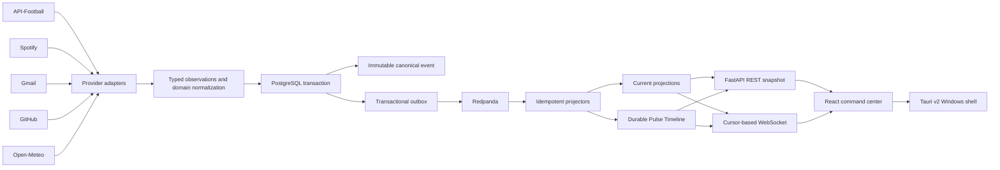

# LivePulse

LivePulse is a local-first realtime personal command center that unifies football, Spotify, Gmail, GitHub, weather, and system health into one durable event-driven timeline.

It is not a collection of API widgets.

Each upstream system has different delivery, consistency, authentication, rate-limit, and recovery semantics. LivePulse normalizes those systems behind one event model, durably persists important state transitions, distributes them through Redpanda, projects current state independently from history, and keeps a desktop client synchronized through REST snapshots and cursor-based WebSocket recovery.

The application runs as a Windows desktop app using Tauri while preserving a React frontend, FastAPI backend, PostgreSQL state store, and Redpanda event backbone. The UI is the visible part; the engineering problem is keeping unlike sources coherent through failures and reconnects.

## Architecture



The simulator used for development follows the same ingestion and normalization path as providers. No source writes the current projection or timeline directly.

The core invariants are:

- Provider DTOs stop at their adapters and do not leak into domain or frontend contracts.
- Canonical events are immutable. Corrections become new events.
- An important event and its outbox message commit in one PostgreSQL transaction before publication.
- Delivery is at-least-once, not exactly-once. Consumers are idempotent.
- Event history records what happened; projections describe what is true now.
- REST snapshots are authoritative. WebSockets deliver increments and recoverable history, but clients never assume every frame arrived.
- Optional provider failure does not prevent the application from starting.
- Credentials stay in the backend and are encrypted at rest.

### Why this is harder than polling five APIs

The sources do not share one meaning of “current.” Football is polled and diffed, with corrections and lifecycle phases. Spotify playback is ephemeral and rate-limited. Gmail exposes a checkpointed history feed whose cursor can expire or be rejected. GitHub combines bounded REST reconciliation with optional signed webhooks. Weather is a cached observation tied to a user-selected location. If those differences leak into the UI, the command center becomes five competing refresh loops. LivePulse owns each source’s mechanics behind an adapter and gives the rest of the system stable events, projections, and health states.

### Event model, outbox, and projections

The canonical event envelope carries identity, source, type, subject, UTC occurrence/observation/ingestion times, version, deduplication key, schema version, correlation ID, and a typed domain payload stored as JSONB. PostgreSQL uniqueness constraints back application-level deduplication.

The ingestion transaction writes the canonical event and corresponding outbox row together. A separate publisher claims pending rows safely, publishes to Redpanda with the subject ID as partition key, and marks a row published only after broker acknowledgement. A crash in between may publish the same event again; it cannot make a committed event disappear. The projector records `(consumer, event_id)` and applies projection/timeline changes in one transaction. Duplicate delivery therefore cannot double-apply a score or timeline row.

The mutable current projection and append-only Pulse Timeline serve different questions. Football projectors update match state; other domains append normalized timeline activity without mutating football state. The timeline has a durable database cursor used for replay and recovery.

### Realtime recovery

REST reconstructs current match/provider state and timeline history after launch or refresh. WebSocket frames carry incremental state and timeline notifications with cursor identity. On reconnect, the backend can replay rows after the last cursor or ask the client to resynchronize; the frontend refetches authoritative REST state after gaps/reconnects and rejects stale versions. A lost notification can delay the next visible update, but it does not make the browser’s last frame authoritative.

## Provider semantics

| Source | Integration behavior |
|---|---|
| Football | API-Football; quota-aware adaptive polling, fixture diffing, normalized phases, score corrections, and meaningful canonical match events. Initial fixture discovery establishes a quiet baseline instead of flooding the timeline. |
| Spotify | Server-side OAuth, encrypted tokens, current playback/device/context state, typed playback controls, and adaptive polling. Packaged OAuth opens the fixed backend start URL in the system browser and returns to a local completion page; the desktop observes persisted connection state. |
| Gmail | Read-only `gmail.readonly` OAuth and checkpointed incremental metadata sync. A rejected history cursor gets one bounded full resync; the replacement checkpoint commits with accepted durable ingestion work. No send, reply, draft, label, delete, or other mailbox mutation exists. |
| GitHub | Fixed five-repository allowlist (Strata, Tandem, OptiScale, LivePulse, Portfolio), bounded startup/catch-up REST reconciliation, and HMAC-verified webhook ingestion. Webhooks are supported but do not require a permanent public tunnel for the v1 local runtime. |
| Weather | Open-Meteo geocoding and weather; selected place and five recents persist in PostgreSQL. Selecting a location refreshes promptly and drives the atmosphere from that place’s local time and observed conditions. The dashboard clock remains system-local. |

Missing credentials disable only their provider. Health reports observed status and safe diagnostic codes without returning secrets, message content, or personal location details. Setup and provider-specific limits are in [`docs/SECURITY_AND_PRIVACY.md`](docs/SECURITY_AND_PRIVACY.md) and the provider package READMEs.

## Windows desktop runtime

LivePulse ships as a Windows-first Tauri v2 application. Tauri is intentionally a thin native shell:

- React owns presentation and application interactions.
- FastAPI owns provider integrations and business APIs.
- PostgreSQL owns durable state and history.
- Redpanda distributes canonical events.
- Docker Compose is the local runtime substrate for PostgreSQL, Redpanda, and FastAPI.
- Tauri owns the native window, readiness/retry surface, window state, fullscreen, safe external navigation, packaged OAuth handoff, and installers.

Tauri does not start or stop Docker services. Start the Compose backend before opening the desktop app. Browser development remains supported. The Windows installers are NSIS and MSI; v1 is unsigned. The shell grants no arbitrary shell or filesystem access, and no provider secrets enter the React bundle or Tauri IPC.

For desktop development, start the services and then run `npm run tauri:dev` from `web/`. Build an installer with `npm run tauri:build` from `web/`; outputs are under `web/src-tauri/target/release/bundle/`. Microsoft’s WebView2 runtime and the Windows Rust/MSVC build prerequisites are required to develop/build. The full setup is below.

## Security and local data

`PERSONAL_LOCAL` is a single-user local application protected by loopback isolation, exact Host/Origin checks, and encrypted provider credentials. It is not a remotely exposed multi-user service and does not claim conventional account authentication. Gmail is strictly read-only. Spotify/Gmail credentials remain server-side. PUBLIC_DEMO is a separate sanitized runtime with its own database/role and allowlists; it is not the personal data store. The product UI does not present demo fixtures or pretend they are provider data.

Retention is an explicit maintenance command with a bounded 365-day default. A separate confirmation-gated purge exists for local data deletion. See [`docs/SECURITY_AND_PRIVACY.md`](docs/SECURITY_AND_PRIVACY.md) for ports, boundaries, configuration, OAuth scopes, retention, and purge procedures.

## Semantic visual system

LivePulse treats motion as another projection of system state rather than decoration. Canonical app transitions feed a deduplicated visual-event layer: a goal, mail arrival, CI change, provider recovery, Focus change, Match Mode, or selected weather can drive a restrained reaction. Historical Timeline rows do not replay as new arrivals, and repeated equivalent snapshots do not retrigger old effects.

One lazy-loaded React Three Fiber atmosphere supplies environmental depth; readable controls and information remain normal DOM. CSS and motion primitives handle score, surface, and signal choreography. Adaptive quality, hidden-window suspension, and `prefers-reduced-motion` reduce unnecessary work. The atmosphere responds to Focus, connection, match events, local weather, and the selected weather location’s time. No formal long-duration GPU/FPS benchmark is claimed.

## Failure cases found in real integration

Real providers broke assumptions that fixtures had not.

**Gmail rejected a persisted history cursor.** OAuth, profile, message listing, and metadata hydration were healthy, but the incremental history call rejected the saved cursor with HTTP 400. Gmail cursors are external durable state, not a guarantee of validity. The adapter now treats a 400 or 404 from `history.list` as one bounded recovery: it reads a fresh profile baseline, scans a bounded recent set, hydrates metadata, and advances the cursor only in the same durable ingestion transaction. Credentials remain intact; unrelated 400/401/403/429 failures retain their normal semantics.

**Football’s provider knew a match was live while the hero said “upcoming.”** API-Football, canonical events, outbox, Redpanda, and the projector were working. The real live projection was omitted from the live-state selection when no demo match was active, and the frontend did not normalize API-Football’s “First Half” phase as live. The correction made provider-backed normalized phase authoritative, protected newer state from stale pre-match snapshots, and removed wall-clock guesses of live status. An already-open browser then updated through the normal projection and realtime path.

**Reconnect is a state-reconstruction problem as well as a transport problem.** WebSockets can miss frames during a disconnect or process restart. Durable cursors let the server replay or request resync; REST remains the source for rebuilding current state and history. The browser never needs an uninterrupted socket history to recover.

Other corrected failures are recorded in [`docs/DEFINITION_OF_DONE.md`](docs/DEFINITION_OF_DONE.md), including duplicate publication, test consumer isolation, Spotify startup-test contract, and packaged OAuth completion.

## Validation evidence

Final local release validation is recorded in [`docs/DEFINITION_OF_DONE.md`](docs/DEFINITION_OF_DONE.md) and is rerun for the v1 closeout below. It covers backend and PostgreSQL/Redpanda tests, Ruff, frontend tests/lint/typecheck/build, npm audit, Rust formatting/check/clippy, Compose health, and Windows NSIS/MSI packaging. Remote GitHub-hosted CI is not claimed as run unless explicitly stated. Live provider health and the real football path were verified during runtime work; automated tests mock provider APIs. Interactive provider consent is not represented as automated evidence.

## Run locally

Requirements: Windows 10/11, PowerShell, Python 3.13, Node 22, Docker Desktop with Compose. Tauri development/build additionally requires stable Rust, the MSVC toolchain/Visual Studio C++ Build Tools, and WebView2.

From the repository root:

```powershell
./scripts/bootstrap.ps1
```

Set provider credentials in the ignored root `.env` as needed. The bootstrap script installs dependencies and starts PostgreSQL and Redpanda. Start the backend in one PowerShell window:

```powershell
./scripts/dev.ps1
```

Start the browser UI in another window:

```powershell
Set-Location web
npm run dev
```

Open <http://localhost:5173>. The all-container browser path is `docker compose up --build -d --wait`. To run the desktop app, ensure `postgres`, `redpanda`, and `backend` are healthy, then from `web/` run `npm run tauri:dev` or open a built installer application.

## Build and validate

From `web/`, `npm run tauri:build` builds the Windows NSIS and MSI packages. Standard local checks:

```powershell
./scripts/test.ps1
```

PostgreSQL/Redpanda tests are opt-in and use an isolated UUID-scoped Kafka topic. With infrastructure running, from `backend/`:

```powershell
$env:LIVEPULSE_INTEGRATION = '1'
python -m pytest
```

The full checked commands and final counts are listed in the v1 closeout record in `docs/DEFINITION_OF_DONE.md`.

## Deliberate v1 limits

- Docker Compose must already be running for the packaged desktop app to become ready; Tauri does not own service startup or shutdown.
- PostgreSQL and Redpanda are not embedded in the installer. NSIS/MSI packages are unsigned.
- GitHub webhook ingestion is implemented, but v1 local setup does not require a permanent public tunnel; bounded reconciliation is available.
- There is no always-on hosted personal deployment, multi-user authentication, AI chat, metrics/tracing stack, load-test result, or Terraform production architecture.
- Packaged Spotify/Google OAuth has a safe browser handoff and completion flow, but a fully automated real-account consent test is not part of the local test suite.
- The motion system adapts quality and pauses in reduced-motion/hidden states; no formal long-duration graphics benchmark has been recorded.
- A lazy-loaded Three.js chunk is approximately 746 kB raw / 192 kB gzip in the known build. It is loaded only for the atmosphere; no bundle-size optimization milestone is claimed.

## Project records

- [`docs/ARCHITECTURE.md`](docs/ARCHITECTURE.md) and [`docs/adr/`](docs/adr/) — system boundaries and accepted decisions.
- [`docs/PRODUCT_REQUIREMENTS.md`](docs/PRODUCT_REQUIREMENTS.md) — locked product requirements and milestone status.
- [`docs/INTERVIEW_NOTES.md`](docs/INTERVIEW_NOTES.md) — concise discussion/reference notes.
- [`docs/RESUME_BULLETS.md`](docs/RESUME_BULLETS.md) — verified resume-ready project bullets; the portfolio repository has only a PDF resume, with no editable source.
- [`docs/UI_VISION.md`](docs/UI_VISION.md), [`docs/UI_STATE_MATRIX.md`](docs/UI_STATE_MATRIX.md), and [`docs/ui-reference/`](docs/ui-reference/) — visual contracts and references.
